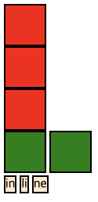

# 03. CSS

## CSS basic

- selector
  - id: `#`
  - class: `.`
  - tag: plain text
- property
  - in selector

```css
selector (id, class, tag name) {
  property-name: value;
}
```

## Inline css vs External css

- inline: file 내에서 style 태그로 css 관리
- external file 로 관리하면 여러 파일에 재사용 가능하기 때문에 inline 은 권장하지 않음

## Box model


> 출처: https://commons.wikimedia.org/wiki/File:W3C_and_Internet_Explorer_box_models.png

- Content
- Padding
- Border
- Margin

## [display] inline vs block vs inline-block

- block: 아무것도 옆에 두도록 허락하지 않음
- inline-block: 옆에 두도록 허락함
- inline: 그냥 텍스트, 높이/폭 이런거 없음, 컨텐츠의 길이만 존재
  - 따라서 기존 설정되어있는 높이/폭은 사라짐

### sample

```html
<!DOCTYPE html>
<html lang="en">
<head>
  <meta charset="UTF-8">
  <meta name="viewport" content="width=device-width, initial-scale=1.0">
  <title>Inline test</title>
  <style>
    .block {
      background-color: red;
      width: 50px;
      height: 50px;
      border:2px solid black;
      display: block; /* 없으면 default 로 block 됨 */
    }
    .inline-block {
      background-color: green;
      width: 50px;
      height: 50px;
      border:2px solid black;
      display: inline-block;
    }
    .inline {
      background-color: blanchedalmond;
      width: 50px;
      height: 50px;
      border:2px solid black;
      display: inline;
    }
  </style>
</head>
<body>
  <div class="block"></div>
  <div class="block"></div>
  <div class="block"></div>
  <div class="inline-block"></div>
  <div class="inline-block"></div>
  <br>
  <span class="inline">in</span>
  <span class="inline">li</span>
  <span class="inline">ne</span>
</body>
</html>
```

### sample-result



## Position property
